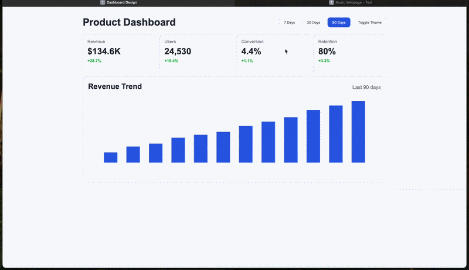

# Dashboard-design

## Project Overview
Dashboard-design is an interactive analytics dashboard built to demonstrate front-end problem-solving in data presentation, state handling, and UI personalization.

The project enables users to switch reporting windows (7D, 30D, 90D), inspect KPI updates instantly, and persist UI theme preference across sessions.

## Tech Stack
- HTML5
- CSS3
- Vanilla JavaScript (ES6)
- Canvas 2D API (for chart rendering)

## Core Functions

### `renderKpiCards(kpiData)`
- Dynamically generates KPI card components from structured data.
- Renders metric title, value, and directional growth indicator.
- Keeps layout reusable when period data changes.

### `renderRevenueChart(series)`
- Draws a responsive bar chart on the canvas.
- Normalizes bar heights based on the current dataset max value.
- Re-renders chart when user changes filters or theme.

### `applySavedTheme()`
- Reads previously selected theme from localStorage.
- Applies dark mode at startup when available.
- Improves continuity in user experience.

### `toggleTheme()`
- Switches between light and dark themes.
- Persists selected mode into localStorage.
- Triggers data visualization refresh for color consistency.

### `filterDashboard(period)`
- Selects the dataset for the requested period (`7d`, `30d`, `90d`).
- Updates period label, KPI cards, and revenue chart in one flow.
- Acts as the central coordination function for dashboard state.

## Current Highlights
- Time-based analytics filtering
- Theme persistence
- Component-style rendering in plain JavaScript

## Suggested Next Features
- Add metric comparison vs previous period.
- Add API integration for real data input.

## Demo

